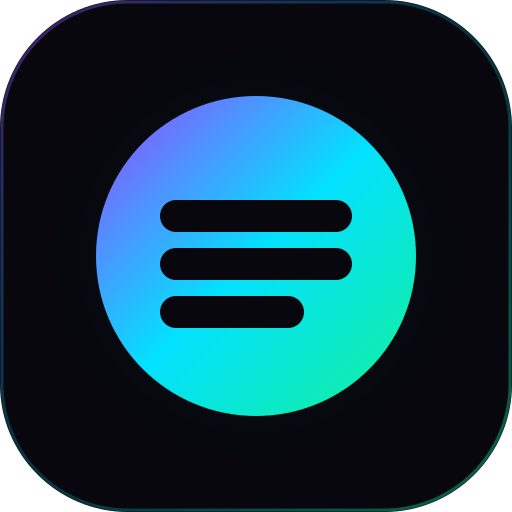

<p align="center">
  
</p>

<h1 align="center">OpenStock</h1>

<p align="center">
  A trading desk for tokenized stocks on Solana — and a launchpad for tokens quoted in those stocks.
  <br />
  <a href="https://joinopenstock.xyz"><strong>joinopenstock.xyz</strong></a>
</p>

---

OpenStock lets anyone browse, analyze and trade [xStocks](https://xstocks.fi) (Backed's tokenized equities, such as `NVDAx`, `AAPLx`, `TSLAx`) on Solana, and launch a new token whose bonding curve is **quoted in a stock instead of SOL or USDC** (`YOUR_TOKEN × NVDAx`) on Meteora Dynamic Bonding Curve or Pump.fun.

Every number on the desk comes from a live source (the issuer, Jupiter, Meteora, GeckoTerminal, DexScreener, Pyth or Solana itself). When a source is unavailable the UI says so; it never fills in a sample value.

## Features

### Stock desk
- **32 curated xStocks** with live issuer reference price, Solana DEX price, 24h change, volume and liquidity.
- **Real price history** — USD OHLCV (1m → 1d) from each stock's most liquid Solana pool via GeckoTerminal.
- **Evidence panel** per stock: issuer reserves and backing ratio, share multiplier, oracle cross-check (Pyth feed, or Jupiter when a stock has no Pyth feed — always labelled), Meteora pools, Jupiter quote impact.
- **Market orders** routed by Jupiter. The order is sized on the same on-chain price the slip shows, and the client refuses to sign if Jupiter's quote would deliver more than 1% less than displayed.
- **Limit, stop-loss, OCO and DCA** rules through Jupiter Trigger, with a review → funding flow.
- **Corporate actions** (splits, dividends, multiplier changes), price/liquidity watches, news, portfolio and receipts.

### Stock-paired launches
- **Meteora DBC, three curve styles per stock**, each its own on-chain PoolConfig:

  | Curve | Shape | Base fee | Creator share | Graduates at (token FDV) |
  |---|---|---|---|---|
  | Equity Standard | Even liquidity | 1.5% | 50% of fees | ~$69k |
  | Equity Momentum | Thin early liquidity — fast early price discovery | 2.0% | 50% of fees | ~$85k |
  | Equity Deep Book | Deep early liquidity — low slippage for first buyers | 1.0% | 50% of fees | ~$100k |

  The launch studio reads each config's fee and migration threshold from chain, so what you see is what the program enforces. Pools migrate to **Meteora DAMM v2** with the migrated liquidity permanently locked.
- **Pump.fun** launches quoted in an xStock via ClawPump. A paid launch that fails at the final step can be finished later without paying again.
- **Launches are verified on-chain** before they appear on the desk: the transaction signature, the derived pool address and the pool creator are all checked.
- **Community market**: OpenStock launches plus existing pools found on DexScreener that trade directly against an xStock, with real holders from Solana and look-alike ticker warnings.

### Wallets
- Phantom, Solflare, Backpack, OKX and Coinbase through Solana Wallet Adapter; Mobile Wallet Adapter on Android; deep links into wallet browsers on iOS.
- Optional email / Google login through Privy (view-only — it cannot sign).
- Non-custodial: every transaction is signed in the user's wallet. OpenStock never holds keys.

## Live Meteora DBC configs (mainnet)

| Stock | Standard | Momentum | Deep Book |
|---|---|---|---|
| NVDAx | [`5Fx7AK…6XNF`](https://solscan.io/account/5Fx7AKBiTGbX8LMqUjzf89yiTpK9U6Q2utyyFv7H6XNF) | [`GHHmbo…Nbpn`](https://solscan.io/account/GHHmbodZBJdqs6hK2oigKJEfTGrvHhmjTmKB3yeqNbpn) | [`D2xY6r…FjV3`](https://solscan.io/account/D2xY6rQZjuJY8jGNStM574CN4cxcjxCVTkvo89FTFjV3) |
| AAPLx | [`4sMonW…MDMpn`](https://solscan.io/account/4sMonWH7dd53dr55b71YebbP1HwGHWPLT94q5fgMDMpn) | [`6YozhtJ…jEWP`](https://solscan.io/account/6YozhtJTFpCVkzS8mEXUAeQyGPTz9tX8u5MhByAJjEWP) | [`BFVNHD…JNgn`](https://solscan.io/account/BFVNHDEWgQGm1ibzt4XLCLXk46PJCQpYJTt2UkicJNgn) |

Program: Meteora DBC `dbcij3LWUppWqq96dh6gJWwBifmcGfLSB5D4DuSMaqN`. Both quote mints carry Meteora's Token-2022 token badge.

## Architecture

```
Next.js 15 (App Router, React 19) — deployed on Vercel
│
├─ app/                     Pages and API routes
│  ├─ api/rpc               Same-origin Solana JSON-RPC relay (method allowlist, rate limit)
│  ├─ api/candles           USD OHLCV from GeckoTerminal
│  ├─ api/evidence          Issuer price, reserves, oracle, Meteora pools per stock
│  ├─ api/launch/*          Venues, pairs, Pump.fun preflight/confirm, Meteora prepare/confirm, uploads
│  ├─ api/trade/*           Jupiter order prepare / execute
│  ├─ api/token-holders     Largest holders from Solana
│  └─ api/token-metadata    Metaplex JSON for DBC launches
├─ components/              Desk, launch studio, community market, wallet session
├─ lib/
│  ├─ meteora-dbc.ts        DBC config lookup, pool/migration builders, on-chain verification
│  ├─ community-tokens.ts   Launch registry + DexScreener discovery
│  ├─ market-evidence.ts    Issuer, Pyth, Jupiter, Meteora evidence
│  ├─ json-store.ts         Upstash Redis (prod) / local JSON files (dev)
│  └─ solana-curated-25.json  Curated xStock registry (mints, 8 decimals)
└─ scripts/
   ├─ create-meteora-configs.mjs  Creates the per-stock DBC configs
   └─ verify-scaled-amounts.mjs   Share-multiplier math tests (npm test)
```

**Data sources:** xStocks/Backed API (issuer price, reserves, multipliers, corporate actions) · Jupiter Price v3, Swap and Trigger APIs · Meteora DBC SDK and pool API · GeckoTerminal (candles) · DexScreener (community pools) · Pyth Hermes · Solana RPC.

## Getting started

Requirements: Node.js 20+.

```bash
git clone https://github.com/Datwebguy/openstock.git
cd openstock
npm install
cp .env.example .env.local   # fill in what you need
npm run dev                  # http://localhost:3000
```

The desk works without any keys (browse and paper-review mode). Keys unlock live features.

### Environment variables

| Variable | Needed for |
|---|---|
| `SOLANA_RPC_URL` | Server-side RPC. Use a keyed endpoint (e.g. Helius) in production; the browser reaches it only through `/api/rpc`. |
| `UPSTASH_REDIS_REST_URL` / `UPSTASH_REDIS_REST_TOKEN` | Storage for accounts, receipts, alerts, launches and uploads. The Vercel KV names `KV_REST_API_URL` / `KV_REST_API_TOKEN` also work. Required on serverless; local dev falls back to `.data/`. |
| `JUPITER_API_KEY` | Live stock trades and trigger/DCA orders. Without it the desk is browse-only. |
| `CLAWPUMP_API_KEY` | Pump.fun launches. |
| `METEORA_DBC_CONFIGS` | Meteora DBC launches: `{"NVDAx":{"standard":"…","momentum":"…","deep":"…"}}` |
| `NEXT_PUBLIC_PRIVY_APP_ID` | Optional email / Google login. |
| `PYTH_HERMES_API_KEY` | Optional Pyth Hermes key. |

See [`.env.example`](.env.example) for the full list with defaults.

### Creating Meteora DBC configs for more stocks

```bash
# Dry run: prints each config's fee, curve and graduation threshold — sends nothing
node scripts/create-meteora-configs.mjs --symbols NVDAx,AAPLx --fee-claimer <FEE_CLAIMER_PUBKEY>

# Broadcast with a funded payer keypair (~0.006 SOL rent per config)
node scripts/create-meteora-configs.mjs --broadcast --symbols TSLAx --fee-claimer <PUBKEY> --keypair <PATH>
```

The script converts USD market-cap targets into the quote xStock at the live price, skips stocks without a Meteora token badge, and prints the `METEORA_DBC_CONFIGS` value to set in your environment.

## Scripts

```bash
npm run dev        # local server (custom server.mjs)
npm run build      # production build
npm start          # run the production build
npm run typecheck  # TypeScript
npm test           # share-multiplier amount tests
```

## Notes

- xStocks are tokenized equities issued by Backed. They track a share and are backed by shares the issuer holds; they do not give shareholder rights such as voting.
- OpenStock does not ship with, create or store any wallet, private key or seed phrase.
- Nothing here is investment advice. On-chain trading carries risk, including loss of funds.
